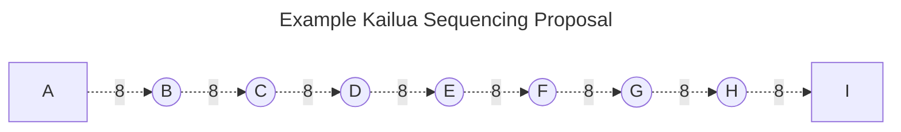
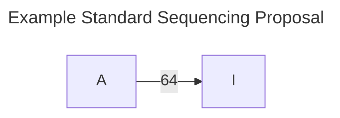
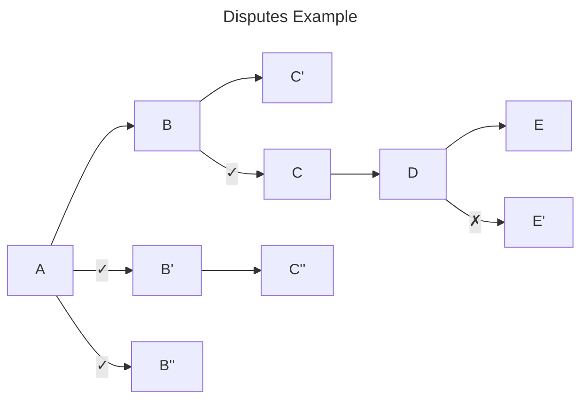

# Design Overview

Kailua's ZK fault proof game operates seamlessly in two main ways:
1. Disputes are non-interactive, removing the need for a "bisection" or multi-round on-chain search for a fault.
2. Disputes are implicit between contradictory proposals, removing the need for a special "challenge" transaction.

## Sequencing

Sequencing proposals in Kailua can utilize the publication of extra data instead of only the single commitment submitted in other protocols
in order to reduce the amount of proving work required to resolve disputes.
This extra data consists of commitments to the intermediate sequencing states, which allows the generated ZK proofs to
target only a sub-sequence of blocks comprising one transition between the intermediate states instead of the entire
proposal.

```admonish note
While Kailua can be configured to operate using a single published commitment per proposal, this may make the proving
work required to resolve disputes impractical for chains with very low block times, or a significantly large number
of blocks per proposal in general.
```

<div style="text-align: center;">





</div>

The above two diagrams illustrate the extended data in Kailua sequencing proposals.
While a standard proposal for sequencing 64-blocks would only comprise a single commitment, the Kailua variant here is
configured to also require the commitment for every 8th block.
In this configuration, any Kailua fault proof would only have to provably derive a sequence of at most 8 blocks. 

```admonish note
To save on DA costs, blobs or alternative DA layers can be used to publish intermediate commitments.
Moreover, as empty blocks are cheap to prove, an intermediate commitment can be defined to cover at most N empty and
at most M non-empty blocks, where N >> M.
```

## Disputes

Each new sequencing proposal implicitly disputes the last existing proposal that contradicts it.
Once this happens, a proof is required to demonstrate which of the two contradictory proposals, if any, commits to the
correct sequencing state at their first point of divergence.
The proof then eliminates one, or both, contradictory proposals, and neither proposals can be finalized until the proof
is submitted.

```admonish note
While any new contradictory proposal has to be made within the timeout period of the prior proposal it contradicts, 
proofs are granted an unlimited amount of time for permissionless submission by anyone.
```

<div style="text-align: center;">



</div>

Consider the above example scenario, where proposal `A` is finalized, while `B`, `C`, `D` and `E` are the only correct sequencing
proposals pending finalization, while all others are invalid.

A plain edge from a parent to a child indicates that the child proposal was made while no contradictory siblings should have existed.
A checkmark on the edge indicates that the proposal was made within the timeout period of the contradicotry sibling.
A crossmark indicates that the timeout period of the contradictory sibling proposal had expired before the child proposal was introduced.

The following three challenges are the only ones implied:
1. `B'` challenges `B`
2. `B''` challenges `B` (the proof for the prior challenge will eliminate `B'`).
3. `C` challenges `C'`.

The following two invalid proposals created no challenges:
1. `C''` has no siblings and therefore causes no implicit challenges, but will be eliminated once its parent `B'` is eliminated.
2. `E'` was made after the timeout period for `E` had expired, and was automatically eliminated.

In this scenario, `B` can only be finalized once two proofs are submitted to resolve its disputes against `B'` and `B''`.
Proposal `C` can only be finalized once a proof resolves its dispute against `C'`, and its parent `B` is finalized.
`D` has no contenders and can be finalized once its parent `C` is finalized.
The timeout period for `E` had passed before `E'` was introduced, and therefore `E` can be finalized once its parent `D` is finalized.